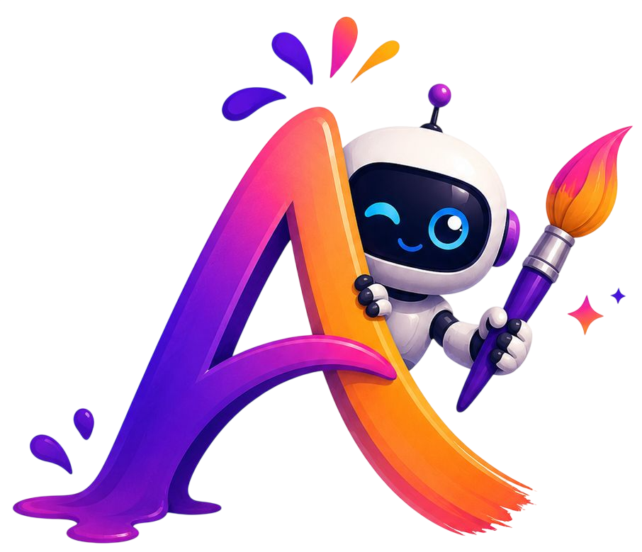

<p align="center">
  
</p>

<h1 align="center">Artzy-AI</h1>

<p align="center">
  **🌐 Live Demo → [artzy-ai.netlify.app](https://artzy-ai.netlify.app)**
</p>

<p align="center">
  
  
  
  
  
  
  
</p>

---

> Artzy-AI is a full-stack AI image generation platform where users create high-quality artwork using natural language prompts, explore community creations, like and share their favourites — all with a free weekly quota.

---

## 🎥 Project Demo

<p align="center">
  
</p>

---
## 🎯 Key Highlights

- Built a complete full-stack AI SaaS application
- Integrated Stable Diffusion XL for AI image generation
- Developed Artzy Bot using Gemini 2.5 Flash with HuggingFace Qwen fallback
- Implemented Google OAuth and Email OTP authentication
- Added weekly generation quota system
- Integrated Cloudinary for secure image storage
- Developed community sharing and engagement features
- Built responsive UI supporting desktop, tablet, and mobile devices
- Implemented AI content moderation and safety checks

---

## ✨ Features

- 🖼️ **AI Image Generation** — Stable Diffusion XL via HuggingFace
- 🔐 **Auth** — Email/password with OTP verification + Google OAuth
- 🤖 **Artzy Bot** — AI chat assistant to craft perfect prompts (Google Gemini, free)
- 📊 **Weekly Quota** — 10 free generations per week per user
- ❤️ **Likes & Community Showcase** — Browse, like, and share AI art publicly
- 🔗 **Smart Share Links** — Shared links scroll to and highlight the exact image
- 🌙 **Dark / Light Mode** — System preference aware
- 📱 **Fully Responsive** — Works on all screen sizes
- 🛡️ **Content Moderation** — Blocks inappropriate prompts automatically

---

## 🛠️ Tech Stack

| Layer | Tech |
|---|---|
| Frontend | React 18, Vite, TailwindCSS |
| Backend | Node.js, Express, MongoDB |
| Auth | JWT + Passport.js (Google OAuth) |
| AI Images | HuggingFace — Stable Diffusion XL |
| AI Prompts | Google Gemini 2.5 Flash + HuggingFace Qwen Fallback |
| Image CDN | Cloudinary |
| Email | Brevo (OTP & welcome emails) |
| Deploy | Netlify (frontend) + Render (backend) |

---

## 🚀 Quick Start

### 1. Clone the repo

```bash
git clone https://github.com/Pramukh-P/Artzy-AI.git
cd Artzy-AI
```

### 2. Install dependencies

```bash
# Backend
cd server && npm install

# Frontend
cd ../client && npm install
```

### 3. Set up environment variables

```bash
# Backend
cd server
cp .env.example .env        # fill in your values

# Frontend
cd ../client
cp .env.example .env        # set VITE_API_URL=http://localhost:8080
```

### 4. Run locally

```bash
# Terminal 1 — Backend (port 8080)
cd server && npm run dev

# Terminal 2 — Frontend (port 5173)
cd client && npm run dev
```

Open **http://localhost:5173** 🎉

---

## 🔑 Environment Variables

### `server/.env`

```env
PORT=8080
MONGODB_URL=                  # MongoDB Atlas connection string
JWT_SECRET=                   # Any random 32+ char string

HF_TOKEN=                     # HuggingFace API token → huggingface.co
HUGGINGFACE_API_KEY=          # Use the same HuggingFace key for both

CLOUDINARY_CLOUD_NAME=        # Cloudinary dashboard → cloudinary.com
CLOUDINARY_API_KEY=
CLOUDINARY_API_SECRET=

BREVO_API_KEY=                # Brevo email API → brevo.com
BREVO_SENDER_EMAIL=
BREVO_SENDER_NAME=Artzy-AI

GOOGLE_CLIENT_ID=             # Google Cloud Console → console.cloud.google.com
GOOGLE_CLIENT_SECRET=
GOOGLE_CALLBACK_URL=http://localhost:8080/api/v1/auth/google/callback

FRONTEND_URL=http://localhost:5173

GEMINI_API_KEY=               # FREE → aistudio.google.com/app/apikey
```

### `client/.env`

```env
VITE_API_URL=http://localhost:8080
```
## 📈 Project Statistics

- 15+ REST API Endpoints
- Google OAuth Authentication
- Email OTP Verification System
- AI Prompt Assistant with Fallback Architecture
- Weekly Quota Management
- Community Sharing Platform
- Secure Cloud Image Storage
- Responsive User Interface
- AI Content Moderation Layer

---

## 📡 API Endpoints

| Method | Endpoint | Description |
|---|---|---|
| `POST` | `/api/v1/auth/register` | Register + send OTP |
| `POST` | `/api/v1/auth/verify-otp` | Verify email OTP |
| `POST` | `/api/v1/auth/login` | Login with email/password |
| `POST` | `/api/v1/auth/forgot-password` | Send password reset OTP |
| `GET` | `/api/v1/auth/google` | Google OAuth login |
| `GET` | `/api/v1/auth/me` | Get current user |
| `POST` | `/api/v1/ai` | Generate image from prompt |
| `GET` | `/api/v1/ai/quota` | Get remaining weekly quota |
| `GET` | `/api/v1/post` | Get community posts (public) |
| `POST` | `/api/v1/post` | Save generated image |
| `GET` | `/api/v1/post/user/my` | Get current user's creations |
| `PATCH` | `/api/v1/post/:id/like` | Toggle like on a post |
| `PATCH` | `/api/v1/post/:id/share` | Toggle community sharing |
| `DELETE` | `/api/v1/post/:id` | Delete a post |
| `POST` | `/api/v1/prompt-bot` | Chat with Artzy Bot |

---

## 📦 Project Structure

```
Artzy-AI/
├── client/                   # React frontend (Vite)
│   ├── public/               # Static files — place Loader.mp4 here
│   └── src/
│       ├── components/       # Navbar, Card, PromptBot, RenderLoader…
│       ├── pages/            # Home, CreatePost, MyCreations, Auth pages
│       ├── context/          # Auth, Theme, Toast
│       └── hooks/            # useServerHealth
└── server/                   # Node.js backend
    ├── routes/               # auth, post, ai, promptBot, googleAuth
    ├── mongodb/              # Mongoose models (User, Post)
    ├── middleware/           # JWT auth guard
    └── utils/               # email, quota, contentFilter
```

---

## 🌍 Deploy

| Platform | Service | Config |
|---|---|---|
| **Render** | Backend | Root: `server` · Build: `npm install` · Start: `npm start` |
| **Netlify** | Frontend | Base: `client` · Build: `npm run build` · Publish: `dist` |

- Set `VITE_API_URL` → your Render URL (in Netlify env vars)
- Set `FRONTEND_URL` → your Netlify URL (in Render env vars)

---

## 🤝 Contributing

Contributions are welcome!

```bash
# 1. Fork the repo and create your branch
git checkout -b feature/your-feature-name

# 2. Commit your changes
git commit -m "feat: add your feature"

# 3. Push and open a Pull Request
git push origin feature/your-feature-name
```

Open a Pull Request after pushing your changes.
---

## 👨‍💻 Author

**Pramukh P** 

[GitHub](https://github.com/Pramukh-P)

---

<p align="center">⭐ If you like this project, please star the repository — it helps a lot!</p>