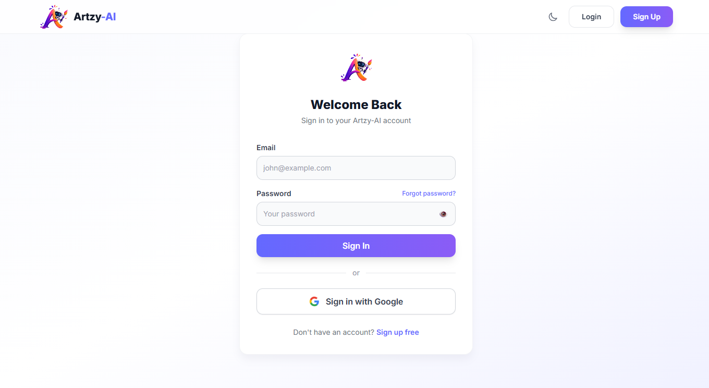
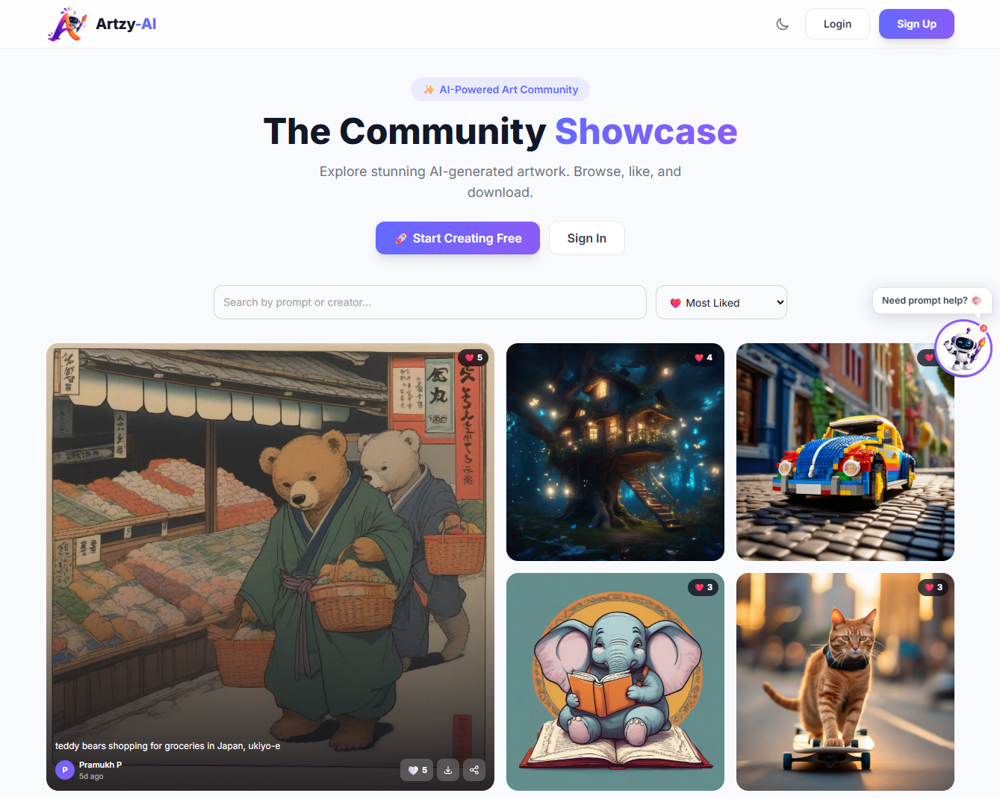
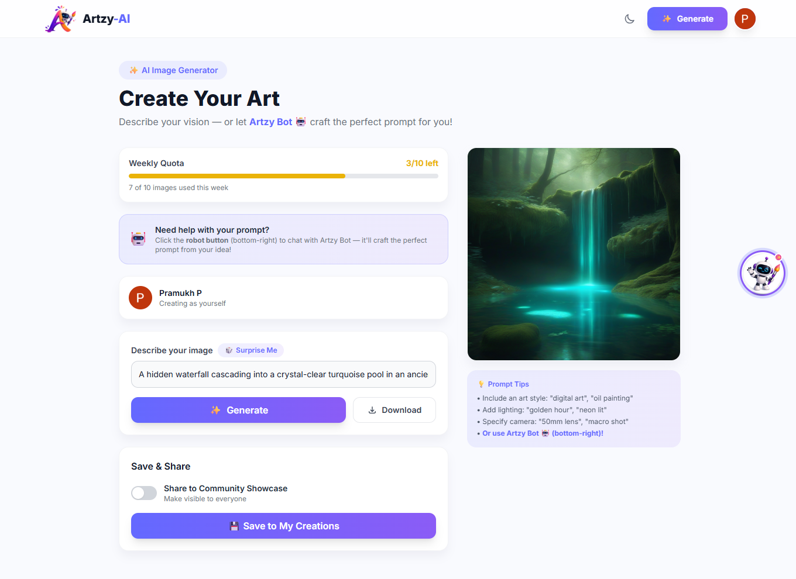
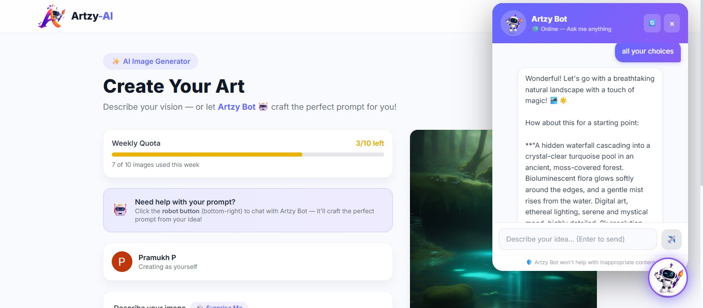

# 🎨 Artzy-AI

> Generate stunning AI-powered images and share them with the community.

**🌐 Live Demo → [artzy-ai.netlify.app](https://artzy-ai.netlify.app)**


---
## 🎥 Project Demo

<table>
<tr>
<td width="20%">

</td>

<td width="20%">

</td>

<td width="20%">

</td>

<td width="20%">

</td>

<td width="20%">

</td>
</tr>
</table>

## ✨ Features

- 🖼️ **AI Image Generation** — Stable Diffusion XL via HuggingFace
- 🤖 **Artzy Bot** — AI chat assistant to craft perfect prompts (Google Gemini, free)
- ❤️ **Likes & Community Showcase** — Browse, like, and share AI art publicly
- 🔐 **Auth** — Email/password with OTP verification + Google OAuth
- 📊 **Weekly Quota** — 10 free image generations per week per user
- 🌙 **Dark / Light Mode** — System preference aware
- 📱 **Fully Responsive** — Works on all screen sizes
- 🛡️ **Content Moderation** — Blocks inappropriate prompts automatically

---

## 🛠️ Tech Stack

| Layer | Tech |
|---|---|
| Frontend | React 18, Vite, TailwindCSS |
| Backend | Node.js, Express, MongoDB |
| AI Images | HuggingFace (SDXL) |
| AI Prompts | Google Gemini 1.5 Flash (free) |
| Image CDN | Cloudinary |
| Email | Brevo (OTP & welcome emails) |
| Auth | JWT + Passport.js Google OAuth |
| Deploy | Netlify (frontend) + Render (backend) |

---

## 🚀 Quick Start

### 1. Clone the repo

```bash
git clone https://github.com/yourusername/artzy-ai.git
cd artzy-ai
```

### 2. Install dependencies

```bash
# Backend
cd server && npm install

# Frontend
cd ../client && npm install
```

### 3. Set up environment variables

```bash
# Backend
cd server
cp .env.example .env
# Fill in your values (see below)

# Frontend
cd ../client
cp .env.example .env
# Set VITE_API_URL=http://localhost:8080
```

### 4. Run locally

```bash
# Terminal 1 — Backend (port 8080)
cd server && npm run dev

# Terminal 2 — Frontend (port 5173)
cd client && npm run dev
```

Open **http://localhost:5173** 🎉

---

## 🔑 Environment Variables

### `server/.env`

```env
PORT=8080
MONGODB_URL=                  # MongoDB Atlas connection string
JWT_SECRET=                   # Any random 32+ char string

HF_TOKEN=                     # HuggingFace API token (free)

CLOUDINARY_CLOUD_NAME=        # Cloudinary dashboard
CLOUDINARY_API_KEY=
CLOUDINARY_API_SECRET=

BREVO_API_KEY=                # Brevo (email OTPs)
BREVO_SENDER_EMAIL=
BREVO_SENDER_NAME=Artzy-AI

GOOGLE_CLIENT_ID=             # Google Cloud Console
GOOGLE_CLIENT_SECRET=
GOOGLE_CALLBACK_URL=http://localhost:8080/api/v1/auth/google/callback

FRONTEND_URL=http://localhost:5173

GEMINI_API_KEY=               # FREE at aistudio.google.com/app/apikey
```

### `client/.env`

```env
VITE_API_URL=http://localhost:8080
```

**All services have free tiers — no credit card required.**

| Service | Get it here |
|---|---|
| MongoDB Atlas | mongodb.com/atlas |
| HuggingFace | huggingface.co → Settings → Tokens |
| Cloudinary | cloudinary.com |
| Brevo | brevo.com |
| Google OAuth | console.cloud.google.com |
| Gemini (Artzy Bot) | aistudio.google.com/app/apikey |

---

## 📦 Project Structure

```
artzy-ai/
├── client/          # React frontend (Vite)
│   ├── public/      # Static files — place Loader.mp4 here
│   └── src/
│       ├── components/   # Navbar, Card, PromptBot, RenderLoader…
│       ├── pages/        # Home, CreatePost, MyCreations, Auth pages
│       ├── context/      # Auth, Theme, Toast
│       └── hooks/        # useServerHealth
└── server/          # Node.js backend
    ├── routes/      # auth, post, ai, promptBot, googleAuth
    ├── mongodb/     # Mongoose models (User, Post)
    ├── middleware/  # JWT auth
    └── utils/       # email, quota, contentFilter
```

---

## 🎬 Cold Start Loader

This app runs on Render's free tier which **sleeps after 15 min of inactivity**.

To handle this gracefully, place your `Loader.mp4` in `client/public/`:
```
client/public/Loader.mp4
```
The loader plays your video in a loop until the server wakes up (~30–60 sec), then loads the app automatically.

---

## 🌍 Deploy

| Platform | Service | Config |
|---|---|---|
| **Render** | Backend | Root: `server` · Build: `npm install` · Start: `npm start` |
| **Netlify** | Frontend | Base: `client` · Build: `npm run build` · Publish: `dist` |

Set `VITE_API_URL` to your Render URL on Netlify.
Set `FRONTEND_URL` to your Netlify URL on Render.

---

## 📝 License

MIT © 2025 Artzy-AI
